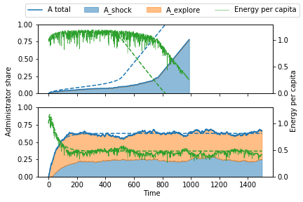

# "We don't need no Administration..." or why trial and error increases survival of societies

## Abstract

In the past twenty years several events disrupted global economics and social wellbeing and generally shook the confidence in the stability of western societies. Popular examples are, the financial crisis, bankrupcy of multiple developed states, populism, war and climate refugees or Brexit. With this background we aimed to identify drivers of societal instability or even collapse. For this purpose a model was developed inspired by the theory of the collapse of complex societies. A simple network model simulated the development of complexity in terms of an administration body as a response to stresses affecting the productivity of the network agents.

We were able to illustrate societal collapse as a function of complexity measured in the share of administration in a network. Furthermore, we identified minimum requirements of the administration and the societal network topology to improve wellbeing of the society, estimated in terms of produced energy per capita. Finally we provide a mechanism for improving wellbeing and survival of the modeled society by enabling agents to randomly change between labor and administration, which is effective at very low rates.

## introduction: why Tainter is relevant today

collapse is considered in the sociopolitical sphere

a society has collapsed when it displays a rapid significant loss of an established level of sociopolitical complexity. It is manifest in things as:
- lower degree of stratification and social differentiation
- less economic and occupational specialization
- less centralized control
- less behavioral control and regulation
- less investment into complexity (architecture, culture)
- less flow of information
- less sharing, trading and redistribution of resources
- less overall coordination and organization

Societies obviously varies in complexity along a continuous scale

It was rather the aim to illustrate a simple mechanism of a many like size of society, distinctiveness of parts, distinct social personalites, specialized roles, mechanisms of organization). Key concepts are inequality and heterogeneity.

Inequality: Unequal access to resources, social participation, power etc.
heterogeneity: Number of distinct parts of society and how the population is distributed among them

### The study of collapse:
Main theories of the collapse of soicieties
on Page 89 of Tainter (1990), all explanations are summarised

#### resource depletion:
fairly obvious reason for collapse. However in complexer societies one might argue that the centralized body of administration should be capable of taking measures against a depleting resource base. (However - own opinion) looking at contemporary societies, there seem to be problems with this). When a society cannot overcome this, it raises questions towards the society and its organisation itself

#### New resource:
unrestricted access to power may render government power ineffective thus resulting in class decomposition

#### Major Catastrophe:
This is a favorite explanation for collapse, however, plenty evidence exists that many societies withstand catastrophes. Of course a catastrophe of the scale of an asteroid may well be critical for collapse

#### Insufficient response to circumstances: (Failure to adapt)
considered to be a superior theory by tainter. Law of Adaptive Potential. The important bit is to review the characteristics of the society instead of the stresses, which lead to collapse.

Dinosour modeL: Society is mighty and powerful, but grown in such a way that it cannot adapt (no adaptive potential).

Runaway Train: Only one way of action, cannot be reversed and paths cannot be changed. This is basically what we implemented!

House of cards model: complex societies are inherently fragile operating on low margins of reserve.

#### Conflict, contradictions, mismanagement
mistreatent of lower classes by upper classes as an example. Revolutions as the result (in simple terms)

#### economic explanations
- decreasing advantages of complexity
- increasing costs of complexity

#### other theories
- Other complex Societies
- Intruders
- social dysfunction
- mystical factors
- concatenation of events

One may only think of \textit{collapse} when considering sufficiently large and complex societies \citep{tainter1990}

\textquoteleft{Human history as a while has been characterized by a seemingly inexorable trend towards higher levels of complexity, specialization, and sociopolitical control, processing greater quantities of energy and information, formation of ever larger settlements and development of more complex and capable technologies.}

## Model description

## Results

### Model of Tainter's theory of collaps of complex societies

The following figure shows the development of the societies administration along the time. Figure a illustrates Tainter's model of diminishing marginal returns of investments. Initially increases in administrator share result in relatively high increases in energy per capita production. After a short time the returns on investment are reduced, stagnate and when a tipping point is reached, any further increase in administrator share has adverse effects on the model society. The dashed lines show an analytic approximation of the model and confirm the underlying model dynamic. Figure b shows the same network modelled with a random exploration rate (i.e. change of node status A -> L or L -> A) of 1%. A low exploration rate visibly affects the survival and energy production of the society and converges to a stable fixpoint as shown by the analytic approximation.

Todo:
- plots:
  - ~~Administration share vs Ecap + analytische Lösung~~
  - Parameter grid (link density, efficiency, survived/energy)
  -
- parameter grids mit analytischer funktion reproduzieren
  - für survived / not survived
  - produced energy (integral ecap)
- Modellbeschreibung:
  - Gleichungen usw.
  - aussagekräftige Grafik
- lowest exploration rate herausfinden, die die überlebensdauer der netzwerke steigert
- berechnung t_crit: Zeitpunkt berechnen ab dem Ecap beginnt zu schrumpfen (Interpretation Tainter: Collaps)

<!--  -->

## Storyline

- Introduction
  - Warum ist die Tainter Theorie heute interessant

<!-- Möglichkeit A: Aufschreiben so wie es programmiert wurde.  -->
- Model Description
  - original Tainter Dynamics:
    1. Gesellschaft stirbt immer
    Aussagekräftige Grafik zur Modelldynamik
  - modified Tainter Dynamics:
    mit Exploration
  - Analytic approximation

- Results & Discussion
teil A
  - Exemplarische Ergenisse vom normalen Taintermodell (Plot)
  - Zusammenspiel Link Density, Efficiency "Conditions for an efficient administration"
    - Was sind realistische Effizienzraten und Vernetzungsgrade von Gesellschaften
    - Vergleich
    - Plot
  - makroskopische Näherung mit P_e = 0

teil B
  - das ganze noch mal mit Exploration
  - Main Message mit Plot
  - Erweiterung der makroskopischen Näherung

- Conclusion and Outlook

Arbeitsvorschlag:

Latex Dokument (Overleaf)
1. Abstract
2. Struktur
3. Stichpunkte für Kapitel
4. Abbildung + Bildunterschriften

Bis nächsten Freitag machen
